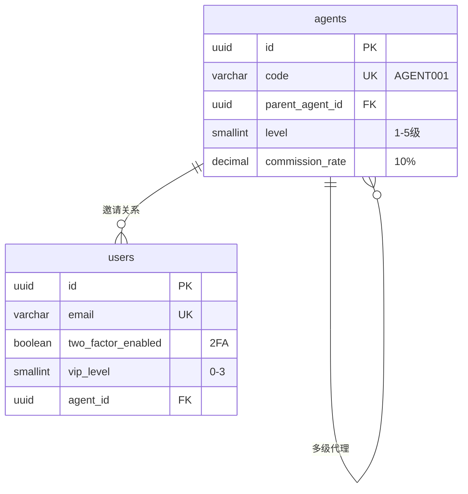
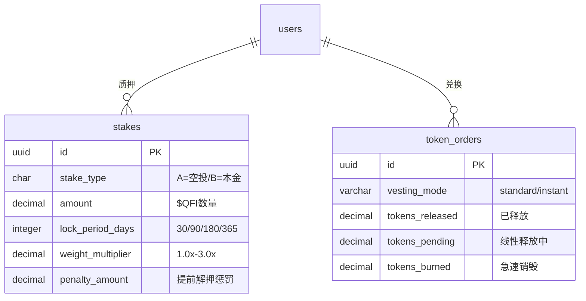
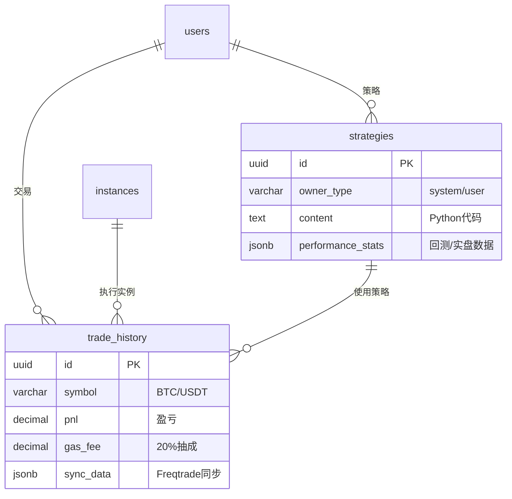

# QuantFi Database ER Diagram

> 基于 QUANTFI_ULTIMATE_WHITE_PAPER v4.0 设计
> Schema 版本: v1.1.0 (2025-12-23)
> 使用 Mermaid 语法，可在 GitHub / VSCode / Notion 等支持 Mermaid 的工具中渲染

## 完整 ER 图

```mermaid
erDiagram
    %% ========================================
    %% 模块 1: Identity (身份认证)
    %% ========================================

    agents {
        uuid id PK "代理商ID"
        varchar code UK "邀请码"
        varchar name "名称"
        varchar email UK "邮箱"
        uuid parent_agent_id FK "上级代理"
        smallint level "代理层级"
        decimal commission_rate "返佣比例"
        integer total_users "累计用户"
        decimal total_commission "累计返佣"
        varchar status "状态"
        timestamp created_at
        timestamp updated_at
    }

    users {
        uuid id PK "用户ID"
        varchar email UK "登录邮箱"
        varchar password_hash "密码哈希"
        boolean two_factor_enabled "2FA开启"
        varchar two_factor_secret "2FA密钥"
        smallint vip_level "VIP等级 0-3"
        timestamp vip_expires_at "VIP到期"
        uuid agent_id FK "邀请人代理"
        varchar invite_code UK "邀请码"
        jsonb device_fingerprints "设备指纹"
        varchar status "状态"
        timestamp last_login_at
        inet last_login_ip
        timestamp created_at
        timestamp updated_at
    }

    %% ========================================
    %% 模块 2: Resources (资源管理)
    %% ========================================

    instances {
        uuid id PK "实例ID"
        uuid user_id FK "所属用户"
        varchar droplet_id "DO实例ID"
        varchar region "机房区域"
        varchar size "规格"
        inet ip_address "公网IP"
        varchar status "状态"
        timestamp last_heartbeat "最后心跳"
        decimal cpu_usage "CPU使用率"
        decimal memory_usage "内存使用率"
        timestamp provisioned_at "开机时间"
        timestamp destroyed_at "销毁时间"
        varchar destroy_reason "销毁原因"
        timestamp created_at
        timestamp updated_at
    }

    api_keys {
        uuid id PK "密钥ID"
        uuid user_id FK "所属用户"
        varchar exchange "交易所"
        varchar label "标签"
        bytea encrypted_blob "加密数据"
        bytea iv "初始化向量"
        bytea auth_tag "认证标签"
        jsonb permissions "权限"
        boolean is_active "是否激活"
        timestamp last_verified_at "最后验证"
        timestamp created_at
        timestamp updated_at
    }

    %% ========================================
    %% 模块 3: Finance (财务管理)
    %% ========================================

    wallets {
        uuid id PK "钱包ID"
        uuid user_id FK UK "所属用户"
        decimal usdt_balance "USDT余额"
        decimal usdt_frozen "USDT冻结"
        decimal points_balance "积分余额"
        decimal points_frozen "积分冻结"
        decimal token_balance "代币余额"
        decimal token_locked "代币锁定"
        decimal token_vesting "代币释放中"
        timestamp created_at
        timestamp updated_at
    }

    billing_logs {
        uuid id PK "账单ID"
        uuid user_id FK "所属用户"
        varchar unique_order_id UK "幂等订单号"
        varchar billing_type "计费类型"
        decimal amount "金额"
        varchar currency "币种"
        varchar reference_type "关联类型"
        uuid reference_id "关联ID"
        text description "描述"
        varchar status "状态"
        timestamp created_at
    }

    withdrawals {
        uuid id PK "提现ID"
        uuid user_id FK "所属用户"
        decimal amount "金额"
        varchar currency "币种"
        decimal fee "手续费"
        varchar chain "链"
        varchar to_address "目标地址"
        varchar tx_hash "交易哈希"
        varchar status "状态"
        uuid reviewed_by FK "审核人"
        timestamp reviewed_at "审核时间"
        text reject_reason "拒绝原因"
        boolean two_factor_verified "2FA验证"
        timestamp created_at
        timestamp updated_at
    }

    %% ========================================
    %% 模块 4: GameFi (代币经济)
    %% ========================================

    stakes {
        uuid id PK "质押ID"
        uuid user_id FK "所属用户"
        char stake_type "类型 A/B"
        decimal amount "质押数量"
        timestamp start_time "开始时间"
        integer lock_period_days "锁定天数"
        timestamp end_time "结束时间"
        decimal weight_multiplier "权重乘数"
        decimal accumulated_reward "累计收益"
        timestamp last_reward_at "最后领取"
        varchar status "状态"
        timestamp early_unstake_at "提前解押"
        decimal penalty_amount "惩罚金额"
        timestamp created_at
        timestamp updated_at
    }

    token_orders {
        uuid id PK "订单ID"
        uuid user_id FK "所属用户"
        decimal points_spent "消耗积分"
        decimal tokens_total "代币总量"
        decimal exchange_rate "兑换汇率"
        varchar vesting_mode "释放模式"
        decimal tokens_released "已释放"
        decimal tokens_pending "待释放"
        decimal tokens_burned "已销毁"
        timestamp vesting_start_at "释放开始"
        timestamp vesting_end_at "释放结束"
        timestamp last_release_at "最后释放"
        varchar status "状态"
        timestamp created_at
        timestamp updated_at
    }

    %% ========================================
    %% 模块 5: Trading (交易模块)
    %% ========================================

    strategies {
        uuid id PK "策略ID"
        varchar owner_type "归属类型"
        uuid owner_id FK "归属用户"
        varchar name "名称"
        text description "描述"
        text content "策略代码"
        jsonb config "配置"
        jsonb performance_stats "性能统计"
        boolean is_public "是否公开"
        boolean is_active "是否激活"
        integer version "版本号"
        timestamp created_at
        timestamp updated_at
    }

    trade_history {
        uuid id PK "交易ID"
        uuid user_id FK "所属用户"
        uuid instance_id FK "实例ID"
        uuid strategy_id FK "策略ID"
        varchar exchange "交易所"
        varchar symbol "交易对"
        varchar side "方向"
        varchar order_type "订单类型"
        decimal entry_price "开仓价"
        decimal exit_price "平仓价"
        decimal quantity "数量"
        smallint leverage "杠杆"
        decimal pnl "盈亏"
        decimal pnl_percentage "盈亏率"
        decimal gas_fee "平台抽成"
        varchar status "状态"
        timestamp opened_at "开仓时间"
        timestamp closed_at "平仓时间"
        jsonb sync_data "同步数据"
        timestamp synced_at "同步时间"
        timestamp created_at
        timestamp updated_at
    }

    %% ========================================
    %% 模块 6: Platform Economics (平台经济)
    %% ========================================

    deposits {
        uuid id PK "充值ID"
        uuid user_id FK "所属用户"
        decimal amount "金额"
        varchar currency "币种"
        varchar method "充值方式"
        varchar chain "链"
        varchar from_address "来源地址"
        varchar tx_hash "交易哈希"
        bigint block_number "区块高度"
        integer confirmations "确认数"
        varchar proof_image_url "截图URL"
        uuid reviewed_by FK "审核人"
        timestamp reviewed_at "审核时间"
        varchar status "状态"
        text reject_reason "拒绝原因"
        timestamp created_at
        timestamp updated_at
    }

    backtests {
        uuid id PK "回测ID"
        uuid user_id FK "所属用户"
        uuid strategy_id FK "策略ID"
        jsonb config "回测配置"
        jsonb results "回测结果"
        integer total_trades "总交易数"
        decimal win_rate "胜率"
        decimal profit_total "总收益"
        decimal profit_percent "收益率"
        decimal max_drawdown "最大回撤"
        decimal sharpe_ratio "夏普比率"
        varchar status "状态"
        text error_message "错误信息"
        timestamp started_at "开始时间"
        timestamp completed_at "完成时间"
        integer duration_seconds "执行时长"
        timestamp created_at
        timestamp updated_at
    }

    instance_backups {
        uuid id PK "备份ID"
        uuid instance_id FK "实例ID"
        uuid user_id FK "所属用户"
        varchar backup_type "备份类型"
        varchar s3_bucket "S3桶"
        varchar s3_key "S3路径"
        bigint file_size_bytes "文件大小"
        jsonb includes "包含文件"
        varchar status "状态"
        text error_message "错误信息"
        uuid restored_to_instance_id FK "恢复到实例"
        timestamp restored_at "恢复时间"
        timestamp created_at
        timestamp expires_at "过期时间"
    }

    user_strategy_configs {
        uuid id PK "配置ID"
        uuid user_id FK "所属用户"
        uuid strategy_id FK "策略ID"
        uuid instance_id FK "实例ID"
        decimal stake_amount "投入金额"
        integer max_open_trades "最大持仓"
        smallint leverage "杠杆倍数"
        decimal stoploss "止损比例"
        boolean trailing_stop "移动止损"
        decimal trailing_stop_positive "触发点"
        jsonb blacklist "黑名单币种"
        jsonb custom_config "自定义配置"
        boolean is_active "是否激活"
        timestamp created_at
        timestamp updated_at
    }

    revenue_distributions {
        uuid id PK "分配ID"
        timestamp period_start "周期开始"
        timestamp period_end "周期结束"
        decimal total_revenue "总收入"
        decimal operations_amount "运营40%"
        decimal buyback_amount "回购40%"
        decimal reserve_amount "储备20%"
        boolean buyback_executed "已执行"
        varchar buyback_tx_hash "回购哈希"
        decimal tokens_bought "回购数量"
        decimal tokens_burned "销毁数量"
        decimal tokens_distributed "分发数量"
        varchar status "状态"
        timestamp created_at
        timestamp updated_at
    }

    token_burns {
        uuid id PK "销毁ID"
        varchar source_type "销毁来源"
        uuid source_id "来源ID"
        decimal amount "销毁数量"
        varchar tx_hash "交易哈希"
        varchar burn_address "销毁地址"
        timestamp created_at
    }

    %% ========================================
    %% 辅助表
    %% ========================================

    announcements {
        uuid id PK "公告ID"
        varchar title "标题"
        text content "内容"
        varchar type "类型"
        boolean is_pinned "置顶"
        integer display_order "排序"
        timestamp start_at "开始时间"
        timestamp end_at "结束时间"
        timestamp created_at
        timestamp updated_at
    }

    agent_commissions {
        uuid id PK "返佣ID"
        uuid agent_id FK "代理商"
        uuid user_id FK "贡献用户"
        varchar source_type "来源类型"
        uuid source_id "来源ID"
        decimal base_amount "消费金额"
        decimal commission_rate "返佣比例"
        decimal commission_amount "返佣金额"
        varchar status "状态"
        timestamp settled_at "结算时间"
        timestamp created_at
    }

    admin_audit_logs {
        uuid id PK "日志ID"
        uuid admin_id FK "管理员"
        varchar action "操作"
        varchar target_type "目标类型"
        uuid target_id "目标ID"
        jsonb details "详情"
        inet ip_address "IP地址"
        timestamp created_at
    }

    %% ========================================
    %% 关系定义
    %% ========================================

    %% Identity 关系
    agents ||--o{ agents : "parent_agent_id"
    agents ||--o{ users : "agent_id"

    %% Resources 关系
    users ||--o| instances : "user_id (1:1 active)"
    users ||--o{ api_keys : "user_id"

    %% Finance 关系
    users ||--|| wallets : "user_id (1:1)"
    users ||--o{ billing_logs : "user_id"
    users ||--o{ withdrawals : "user_id"
    users ||--o{ withdrawals : "reviewed_by"

    %% GameFi 关系
    users ||--o{ stakes : "user_id"
    users ||--o{ token_orders : "user_id"

    %% Trading 关系
    users ||--o{ strategies : "owner_id"
    users ||--o{ trade_history : "user_id"
    instances ||--o{ trade_history : "instance_id"
    strategies ||--o{ trade_history : "strategy_id"

    %% 辅助表关系
    agents ||--o{ agent_commissions : "agent_id"
    users ||--o{ agent_commissions : "user_id"
    users ||--o{ admin_audit_logs : "admin_id"

    %% Platform Economics 关系
    users ||--o{ deposits : "user_id"
    users ||--o{ deposits : "reviewed_by"
    users ||--o{ backtests : "user_id"
    strategies ||--o{ backtests : "strategy_id"
    instances ||--o{ instance_backups : "instance_id"
    users ||--o{ instance_backups : "user_id"
    users ||--o{ user_strategy_configs : "user_id"
    strategies ||--o{ user_strategy_configs : "strategy_id"
    instances ||--o{ user_strategy_configs : "instance_id"
```

## 模块分解视图

### 模块 1: Identity (身份认证)



### 模块 2: Resources (单租户隔离)

```mermaid
erDiagram
    users ||--o| instances : "1用户1VPS"
    users ||--o{ api_keys : "多交易所"

    instances {
        uuid id PK
        uuid user_id FK UK
        varchar droplet_id "DO实例"
        inet ip_address "独立IP"
        timestamp last_heartbeat "心跳检测"
        varchar status "running/destroyed"
    }

    api_keys {
        uuid id PK
        uuid user_id FK
        varchar exchange "binance/okx"
        bytea encrypted_blob "AES-256-GCM"
        bytea iv "初始化向量"
    }
```

### 模块 3: Finance (资金安全)

```mermaid
erDiagram
    users ||--|| wallets : "1:1"
    users ||--o{ billing_logs : "计费记录"
    users ||--o{ withdrawals : "提现申请"

    wallets {
        uuid id PK
        uuid user_id FK UK
        decimal usdt_balance "DECIMAL(18,8)"
        decimal points_balance "Q-Points"
        decimal token_balance "$QFI"
    }

    billing_logs {
        uuid id PK
        varchar unique_order_id UK "幂等键"
        varchar billing_type "subscription/gas_fee"
        decimal amount "DECIMAL(18,8)"
    }

    withdrawals {
        uuid id PK
        decimal amount
        varchar tx_hash "链上哈希"
        boolean two_factor_verified "2FA必须"
    }
```

### 模块 4: GameFi (双轨质押)



### 模块 5: Trading (量化交易)



## 关键设计说明

### 1. 单租户隔离 (白皮书 2.1)
- `instances` 表通过 `UNIQUE INDEX` 确保每用户最多一个活跃 VPS
- `ip_address` 独立，避免交易所连坐封禁

### 2. AES-256-GCM 加密 (白皮书 2.3)
- `api_keys.encrypted_blob`: 加密后的 API Key + Secret
- `api_keys.iv`: 12字节初始化向量
- `api_keys.auth_tag`: 16字节认证标签

### 3. 双轨质押 (白皮书 3.3)
- `stakes.stake_type = 'A'`: 空投/积分来源，提前解押扣50%本金
- `stakes.stake_type = 'B'`: 本金购买，提前解押扣收益+3%手续费
- `stakes.weight_multiplier`: veToken权重 1.0x-3.0x

### 4. 幂等计费 (白皮书 5.2)
- `billing_logs.unique_order_id`: UNIQUE 约束
- 格式: `{type}_{user_id}_{timestamp}_{nonce}`
- 物理杜绝重复扣费

### 5. 心跳熔断 (白皮书 5.2)
- `instances.last_heartbeat`: 15分钟无心跳判定僵尸节点
- 自动触发: 销毁 -> 退款 -> 报警

## 数据类型规范

| 类型 | 用途 | 说明 |
|------|------|------|
| `UUID` | 主键/外键 | 分布式友好 |
| `DECIMAL(18,8)` | 资金字段 | 精确到小数点后8位 |
| `DECIMAL(5,4)` | 比例/费率 | 如 0.1000 = 10% |
| `BYTEA` | 加密数据 | AES 加密 blob |
| `JSONB` | 结构化数据 | 配置/统计/元数据 |
| `TIMESTAMP WITH TIME ZONE` | 时间 | 统一 UTC |
